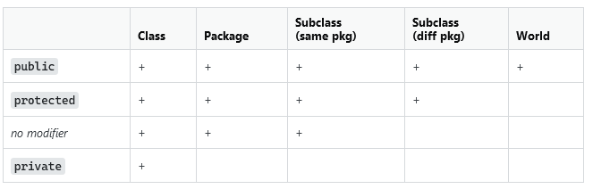

## Часть 3. Классы. Вложенные классы. Модификаторы доступа. Enums
Объявленная ссылочная переменная существует независимо от того, было ли ей присвоено ссылочное значение (то есть объект) или нет.

- Конструктор унаследованного метода должен обязательно вызывать конструктор родителя super()

Имена методв Java должны начинаться с буквы, символа доллара $ или символа подчеркивания _. Символы `-`,  и `#` недопустимы в именах методов.

**Модификатор protected** — переменные, методы и конструкторы, которые объявляются как **protected** в суперклассе,
могут быть доступны только для подклассов в другом пакете или для любого класса в пакете класса **protected**.



Поля и методы, обозначенные модификатором доступа `protected`, будут видны:
-   в пределах всех классов, находящихся в том же пакете, что и наш;
-   в пределах всех классов-наследников нашего класса.

! Методы интерфейса не могут быть помечены как `protected`

Только типы верхнего уровня и вложенные статические классы могут определять статические подклассы, такие как статические константы или енумы.

Анонимные классы не могут быть _final_ и _abstract_

Объявление переменных через запятую допустимо только с явными типами.
вот так нельзя:
```java
var hot = 100, var cold = 20;
var hot = 100, cold = 20;
``` 
Вот так можно:
```java
int x=1, y=2;
```

В интерфейсах все методы без явного обозначения считаются *public*
Только private и private static методы не являются *public*, и они должны быть явно обозначены *private*

У enum - не может быть публичного конструктора.
У всех enum есть метод valueOf(String value)
_public static Class valueOf(String name) throws IllegalArgumentException_

Если в методе прописана _private static_ переменная, то она доступна отовсюду внутри текущего класса. Но в рамках приложения, статическая переменная будет иметь одно значение для всех созданных объектов.
```java
public class Submarine{  
    private static int x =2;  
  
 private void play(){  
        System.out.println(x);  
 }  
      
 public static void main(String[] args) {  
        Submarine submarine = new Submarine();  
        System.out.println(submarine.x);  
 }  
}
```

__final__ экземпляру должно быть присвоено значение (ровно один раз) в строке, в которой он объявлен, в инициализаторе экземпляра или в конструкторе.
