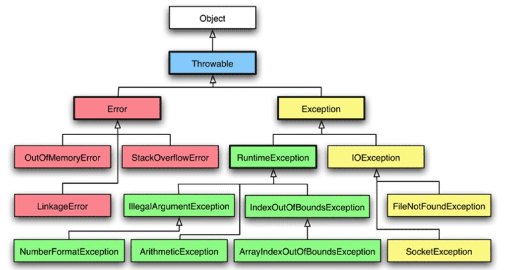

## Часть 4. Exceptions handling
Иерархия


Наследуемые методы могут выбрасывать только исключения которые являются подклассами исключений выбрасываемых в родительских методах. А если родительский метод не выбрасывает исключений, то наследник так же не может их выбрасывать.

Блоки catch, если их несколько штук - должны отлавливать исключения по возрастающей иерархии. Иначе будет ошибка компилляции.
Правильный пример с catch:
 ```java
 try{  
    throw new IOException("Some Message");  
} catch (FileNotFoundException e){  
      
} catch (IOException e){  
      
}
 ```

`try{}` обязательно должен содержать `catch` ИЛИ `finally` блок.

Переменная объявленная в try-with-resources должна быть final или effectively final

**Effectively final**
Объекты или примитивные значения называются **Effectively final**, если мы не изменяем их значения после инициализации.

**Порядок закрытия ресурсов**
Закрываться ресурсы будут с конца. Например
```java
try (Connection conn = DriverManager.getConnection(url, user, pwd);
     Statement stmt = conn.createStatement();
     ResultSet rs = stmt.executeQuery(query);) {
  ...
}
```

Закрывать ресурсы будет в таком порядке
```java
rs.close();
stmt.close();
conn.close();
```


Если `try` блок и `close()`  метод оба выбрасывают исключение, то исключение которое стоит в `close()` подавляется.

Если `catch` блок и `finally` блок оба выбрасывают исключение, то исключение которое стоит в `catch` - подавляется.

В одном catch два класса не могут быть подтипами друг друга. Например:
```java
	  try{
          throw new StungException();
      } catch (FileNotFoundException | Exception e) { //эта строка не скомпилируется
         
      } 
```

Closeable расширяет AutoCloseable
- Closeable.close() throws IOException - этот интерфейс создан для IO ресурсов.
- AutoCloseable.close() throws Exception - этот интерфейс гораздо шире.
  метод close() - идемподентен. Не меняет данных, если его вызвать любое количество раз.
  Если есть проблема закрытия ресурса, то метод close() выбросит исключение.

# Конспект по Java SE 11
- [Часть 1. Типы данных](ch_1_DataTypes.md)
- [Часть 2. Program Flow. Loops](ch_2_Program_flow.md)
- [Часть 3. ООП](ch_3_Oop.md)
- [Часть 4. Исключения](ch_4_Exceptions.md)
- [Часть 5. Arrays](ch_5_Arrays.md)
- [Часть 6. Streams](ch_6_Streams.md)
- [Часть 7. Модульность](ch_7_Modularity.md)
- [Часть 8. Concurrency](ch_8_Concurrency.md)
- [Часть 9. IO](ch_9_IO.md)
- [Часть 10. Secure coding](ch_10_Secure_coding.md)
- [Часть 11. JDBC](ch_11_JDBC.md)
- [Часть 12. Локализации](ch_12_Localization.md)
- [Часть 13. Аннотации](ch_13_Annotations.md)