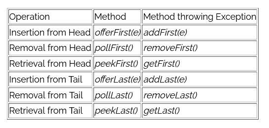

## Часть 5. Working with Arrays and Collections and Generics

Стирание типа означает, что скомпилированный класс java не содержит никакой информации о generics, которая присутствует в файле java. Другими словами, компилятор удаляет общую информацию из класса java, когда он компилирует ее в байтовый код. Например, `List<String> list;` и `List list;` скомпилированы в один и тот же байт-код. Следовательно, во время выполнения не имеет значения, использовали ли вы generic классы или нет, и это позволяет обоим типам классов взаимодействовать, потому что они по сути являются одним и тем же классом для JVM.

Метод
```java
	Arrays.binarySearch(array(), значение)
```
Выполняет поиск указанного значения в указанном массиве с использованием алгоритма двоичного поиска. Перед выполнением этого вызова **массив должен быть отсортирован**. Если массив не отсортирован, то результат будет не определен. Если массив содержит несколько элементов с указанным значением, то нет гарантии, какой из них будет найден.

Wildcard - ? знак вопроса
Запись вида `"? extends ..."` или `"? super ..."` — называется wildcard или символом подстановки, с верхней границей (`extends`) или с нижней границей (`super`). `List<? extends Number>` может содержать объекты, класс которых является `Number` или наследуется от `Number`. `List<? super Integer>` может содержать объекты, класс которых `Number` или  у которых `Number` является наследником (супертип от `Number`).
Пример:
```java
public void drawAll(List<? extends Shape> shapes) {
    ...
}
```

Конструкторы `ArrayList`
```java
public ArrayList()
public ArrayList(int initialCapacity)
public ArrayList(Collection< extends E> c) 
```

`ArrayDeque`
_ArrayDeque_ (“Array Double Ended Queue”, произносится “ArrayDeck”)
отдельный вид очередей, который позволяет нам добавлять или удалять элементы с двух сторон.


Для `LinkedList`:
`peek()` - Retrieves, but does not remove, the head (first element) of this list.
`remove()` - Retrieves and removes the head (first element) of this list.
`poll()` - Возвращает и удаляет первый элемент очереди. Если список пуст, то метод вернёт `null`
`pop()` -  Возвращает и удаляет первый элемент очереди. Если список пуст, то метод выбросит `NoSuchElementException`

`TreeSet`
-   Все элементы уникальны
-   Не сохраняет порядок вставки элементов
-   Сортирует элементы по возрастанию
-   Не потокобезопасен

Optional:
```java
Optional.ofNullable(161);  //так можно
Optional.of(null); //так будет Exception
```
